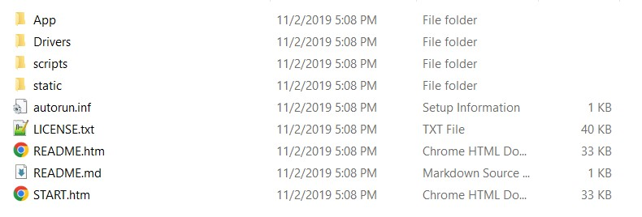
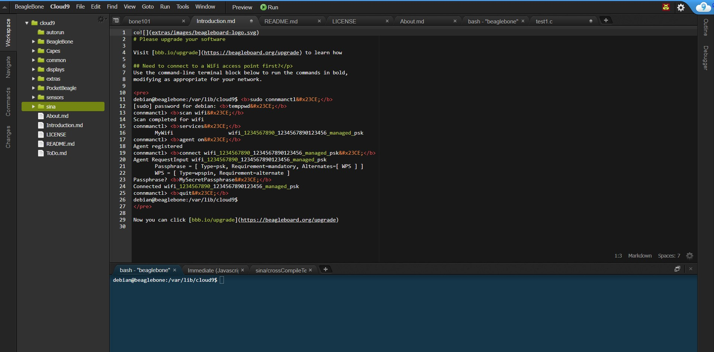

## Introduction

In this repository I report my work on BeagleBone AI board from Texas Instruments and progress I made.

<!------------------------------>

## Table Of Content

- [General Information](#general-information)
- [Board Firmware](#board-firmware)
- [Flashing eMMC](#flashing-emmc)
- [Connenct to Network](#connect-to-network)
- [Updating Board OS and examples](#updating-board-os-and-examples)
- [Bluetooth Connection](#bluetooth-connection)
- [Python Development](#python-development)
- [C/C++ Development](#cc-development)
- [Cross Compiling](#cross-compiling)

<!------------------------------->

## General Information

Built on the proven BeagleBoard.org® open source Linux approach, BeagleBone® AI fills the gap between small SBCs and more powerful industrial computers. Based on the Texas Instruments AM5729, developers have access to the powerful SoC with the ease of BeagleBone® Black header and mechanical compatibility. BeagleBone® AI makes it easy to explore how artificial intelligence (AI) can be used in everyday life via TI C66x digital-signal-processor (DSP) cores and embedded-vision-engine (EVE) cores supported through an optimized TIDL machine learning OpenCL API with pre-installed tools. Focused on everyday automation in industrial, commercial and home applications.<br />

More information about this board can be found in the following link:<br />
https://github.com/beagleboard/beaglebone-ai/wiki/System-Reference-Manual

<!------------------------------>

## Board Firmware

BeagleBone AI comes with a preinstalled firmware ready to use including example codes and a built-in IDE called Cloud9. I've tesetd 3 ways to connect to BeagleBone AI with preinstalled firmware:

- [USB Cable](#usb-cable)
- [StandAlone with Display](#standalone-with-display)
- [SSH over Network](#ssh-over-network)

### USB Cable

In this method I used a USB-C to USB-C Cable and connected BeagleBone AI to my Laptop. After a short time your device recognize the device and you can access the files in your board. The files look like this:

BeagleBone AI comes with an interactive Getting Started document that you can access by openning `START.htm` file.<br />
To access board's IDE and scripts you can open `START.htm` file and access the IP which is reported in this file. IDE Gives access to board's terminal, an editor to write and edit codes and a simple file manager:


### StandAlone with Display

If you wish to use the board as an standalone device, connect the board's USB-C port to a charger and connect the micro-HDMI port to your display. After a short the board's OS will boot and you can use your board as an standlone device.

### SSH over Network

You can connect your Board to a local network and connect to it using the addresses pointed out in `START.htm` file. you can ssh into your board with following informatoin:

```
ssh root@boardIP

password: temppwd
```

The other way you can use your board is that you can download another image for your board, burn it on a SD-card an put it in your board. After you boot up your board, the OS on SD-card will run. In my experiment the custom OS did not boot properly and I couldn't use it.

## Flashing eMMC

In case you want to flash the eMMC, you can download the latest images from the link below:</br>
https://beagleboard.org/latest-images</br>
Flash this image on your SD card. On default the board runs the OS from the SD card itself and does not flash the image on eMMC. To change this, open the fie `/boot/uEnv.txt` and change this line:

```
##enable BBB: eMMC Flasher:
#cmdline=init=/opt/scripts/tools/eMMC/init-eMMC-flasher-v3.sh
```

To this:

```
##enable BBB: eMMC Flasher:
cmdline=init=/opt/scripts/tools/eMMC/init-eMMC-flasher-v3.sh
```

## Connect to Network

There are 2 ways to connect to network with BeagleBone AI:

- [LAN Cable](#lan-cable)
- [WiFi Connection](#wifi-connection)

### LAN Cable

This method is the easiet way to connect to network. Just connect BeagleBone AI to your router. To check if your board is connected or not run:

```

debian@beaglebone:/var/lib/cloud9$ ifconfig eth0

```

### Wifi Connection

If you are using your board as an standalone device with a display, you can simply go to network setting and connect to your network using GUI.<br>
If you are using USB connection please note that in network setting on your PC you should see BeagleBone AI as a network device which you can use to share your own internet with board. In this part I will explain how to use BeagleBone AI Wifi module.<br>
This Board utilizes connman to connect to WiFi network.

```

debian@beaglebone:/var/lib/cloud9$ sudo connmanctl

[sudo] password for debian:temppwd

connmanctl> scan wifi
Scan completed for wifi (This message can take a while to appear please wait for it then proceed to other steps)

connmanctl> services
MyWifi wifi_1234567890_1234567890123456_managed_psk

connmanctl> agent on
Agent registered

connmanctl> connect wifi_1234567890_1234567890123456_managed_psk
Passphrase = [ Type=psk, Requirement=mandatory, Alternates=[ WPS ] ]
WPS = [ Type=wpspin, Requirement=alternate ]
Passphrase? Password
Connected wifi_1234567890_1234567890123456_managed_psk (wait for this message to appear)

connmanctl> quit

```

To check if your device is connected to WiFi network run this command:

```

debian@beaglebone:/var/lib/cloud9$ ifconfig wlan0

```

## Updating Board OS and examples

For information about updating your board visit the link bellow:<br>
https://beagleboard.org/upgrade

## Bluetooth Connection

As of now I have not find a way to use this board's Bluetooth module. You can see the hardware on this device but `bluetoothctl` cannot find a controller module and on GUI version even if you enable Bluetooth you can't find anything with it. Apparently this problem is the same with other BeagleBone AI devices and the only solution I've found is to use an external Bluetooth dongle.

## Python Development

This board comes with python 3.5.3 and python 2.7.13 preinstalled on OS. if you wish to use a newer version you can install your desired version with `apt-get` package manager.<br>
To run your python script enter the command bellow:

```

debian@beaglebone:/var/lib/cloud9$ python test.py

```

## C/C++ Development

This board comes with GCC 6.3. You can update or install other verions with `apt-get` package manager.<br>
To compile your code run the following command:

```

debian@beaglebone:/var/lib/cloud9$ gcc test.c -o test.out

```

## Cross Compiling

This board uses an ARM Processor. If you are using a debian-based Linux on your own device, you can use the following command to install the cross-compiler:

```

$ sudo apt-get install gcc-arm-linux-gnueabi

```

The above command will install the tools represented below:

```

arm-linux-gnueabi-addr2line arm-linux-gnueabi-gcov-7
arm-linux-gnueabi-ar arm-linux-gnueabi-gcov-dump
arm-linux-gnueabi-as arm-linux-gnueabi-gcov-dump-7
arm-linux-gnueabi-c++filt arm-linux-gnueabi-gcov-tool
arm-linux-gnueabi-cpp arm-linux-gnueabi-gcov-tool-7
arm-linux-gnueabi-cpp-7 arm-linux-gnueabi-gprof
arm-linux-gnueabi-dwp arm-linux-gnueabi-ld
arm-linux-gnueabi-elfedit arm-linux-gnueabi-ld.bfd
arm-linux-gnueabi-gcc arm-linux-gnueabi-ld.gold
arm-linux-gnueabi-gcc-7 arm-linux-gnueabi-nm
arm-linux-gnueabi-gcc-ar arm-linux-gnueabi-objcopy
arm-linux-gnueabi-gcc-ar-7 arm-linux-gnueabi-objdump
arm-linux-gnueabi-gcc-nm arm-linux-gnueabi-ranlib
arm-linux-gnueabi-gcc-nm-7 arm-linux-gnueabi-readelf
arm-linux-gnueabi-gcc-ranlib arm-linux-gnueabi-size
arm-linux-gnueabi-gcc-ranlib-7 arm-linux-gnueabi-strings
arm-linux-gnueabi-gcov arm-linux-gnueabi-strip

```

To compile your C code for your board run the following command:

```

$ arm-linux-gnueabi-gcc test.c -o test.out

```

If you wish to compile a C++ code run the following command:

```

g++-arm-linux-gnueabi test.cpp -o test.out

```

After this you can transfer complied binary files to your board using Cloud9 IDE or ssh and run your code there.

```

```
